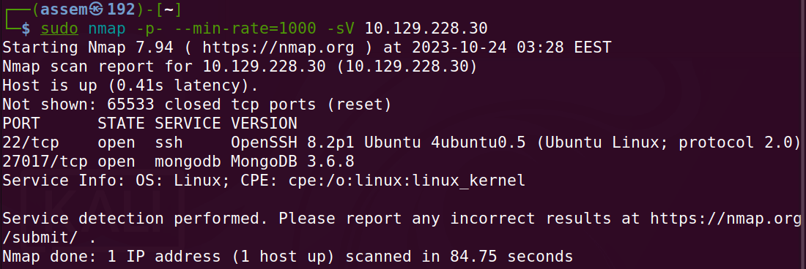
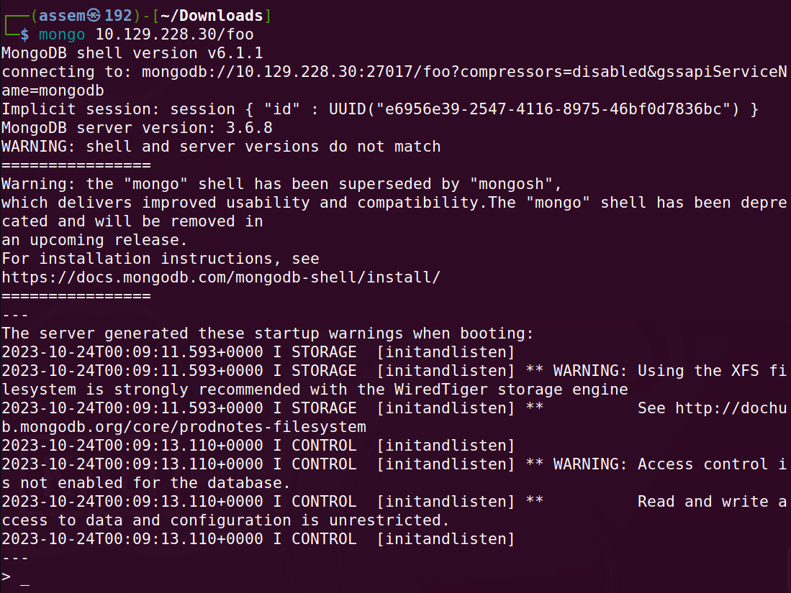
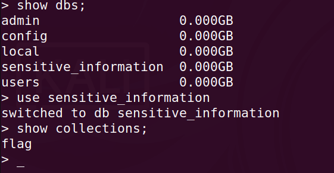
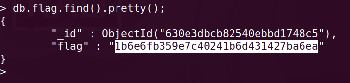

# Basics of penetration testing 

**In our journy to learn penetration testing basics we will take a machines in HTB to can explain the basics of penetration** 

## Every machine has a basic idea to deliver to you .

- in this machine you should get familiar with `database`  .

- Database has more and more than one systems and structure but only have one concept , and you should know how to deal 
  with databases , in this machine we will deal with database which called `mongo database`  .

### Mongod machine in HTB website .

- After connecting with vpn you will spawn the machine and you will have the ip address for this machine .

- As we explained in earlier machines you must know how to download vpn and connect with HTB server and ping for IP_address .

- We will skip all this and begin with nmap searching to check if we have any open ports , if we find any open ports we 
  will search about any services runing on this ports and try to use it to get in the machine .

- you can open in your browser and search about `explainshell` , this website you can type the nmap command which I 
  submited in the next image and will give you a full explaination to how the command works.

***Nmap scan***

- As you can see in the previous image , we have two open ports (22 , 27017) .

	- `22/tcp` is open , and the service work on it is `ssh` , the version is `OpenSSH 8.2p1 Ubuntu 4ubuntu0.5` .

	- `27017` is open , and the service work on it is `mongodb` , the version is `mongodb 3.6.8` .

- Now you know every open ports and know what is the structure we will deal with , and this Hwo you need to think in 
  every machine you will attack , we find port is open and have the one of databases work in it , let's know what is 
  `mongodb` .

***what is mongodb***

 - MongoDB is a NoSQL database management program that uses a document-oriented data model. NoSQL databases are 
   non-relational, meaning they don't use the traditional row and column structure of relational databases. Instead, they store data in documents, which are similar to JSON objects.

- MongoDB is a popular choice for developing modern applications because it is flexible, scalable, and easy to use. It is 
  also well-suited for storing and querying large amounts of data.

***how can i deal with mongodb with command***

- this link will give you step by step downloading to mongodb in linux
  `https://www.mongodb.com/docs/v2.2/tutorial/install-mongodb-on-linux/`.

- To deal with MongoDB with commands, you can use the MongoDB CLI.

- The MongoDB CLI is a powerful tool that allows you to  perform all of the same tasks as a GUI, but with more 
  flexibility.

- To start the MongoDB CLI, open a terminal window and navigate to the directory where the MongoDB CLI is installed. 
  Then, run the following command: `mongo`

- The MongoDB CLI will connect to the local MongoDB database on the default port of 27017.

- Once you are connected to the MongoDB database, you can start running commands. To list all of the databases on the 
  server, run the following command: `show dbs`

- To find documents in a collection, run the following command: `db.COLLECTION_NAME.find({})` .

- `show collections;` :used for listing out the collections in a database .

#### foothold 

- you should downloaded the `mongodb` in you linux machine .

- to connect with mongodb run this command `mongo {IP_address}` .

- Now you need to display directory in the target database , so ru this command in you terminal as you will see .
	
	- `show dbs ;`  to list all databases in the system .

	- `use sensitive_information` : something like acting as a super user in linux .

	- `show collections;` :used for listing out the collections in a database .

- As you can see in the previous image all you need is display what is inside the flag to get the flag and solve the 
  machine .

- we will use this command `db.flag.find().pretty();`to get a pretty format for the content inside the flag .

***the end , now you should have the flag and solved the machine,Congratulations ,Assem_Ayman_44***
